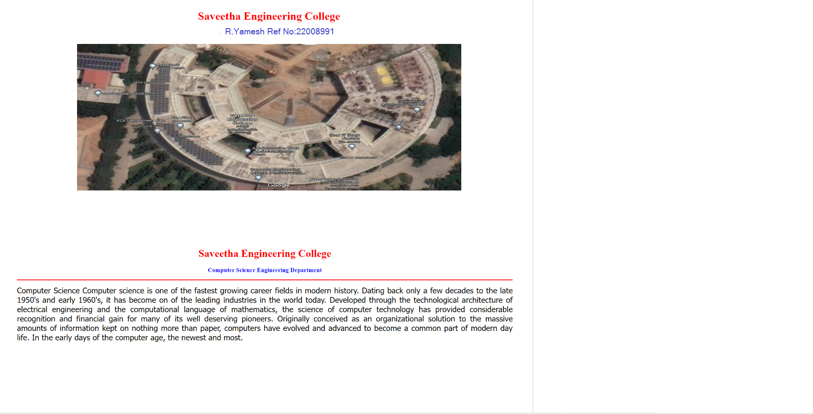
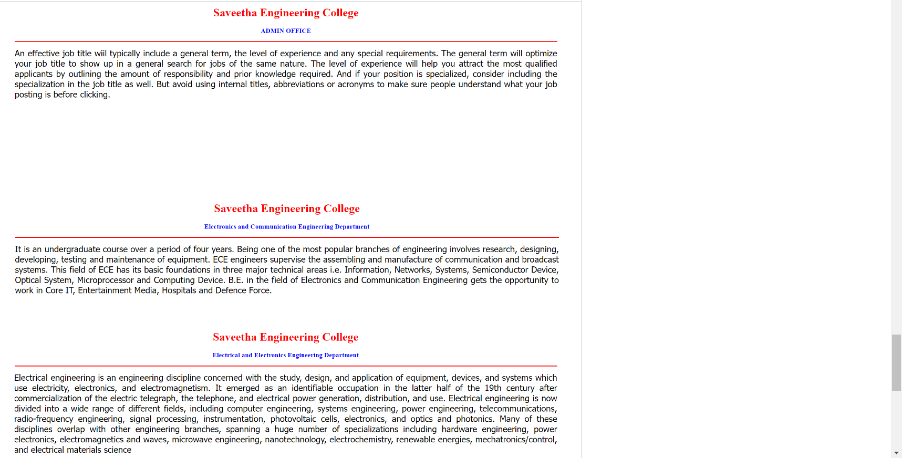
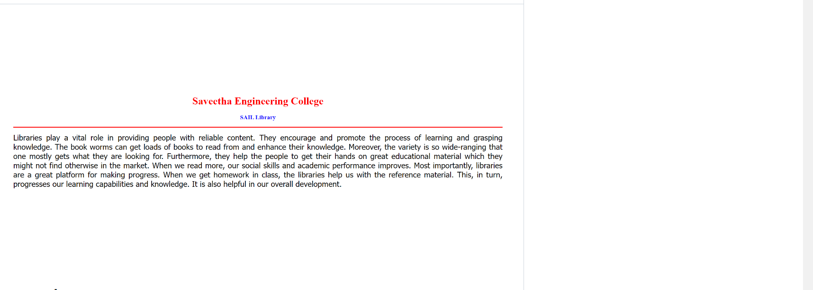

# Places Around Me
# Aim:
To develop a website to display details about the places around my house.

# Design Steps:
## Step 1
First Create the Folders and then input the code to create file.

## Step 2
Take screenshot for Google Map your location and decide minimum 5 places and create static file and create the website file.

# Code:
```
<!DOCTYPE html>
<html lang="en">
<head>
<title>Saveetha Engineering College</title>
</head>
<body>
<h1 align="center">
<font color="red"><b>Saveetha Engineering College</b></font>
</h1>
<h3 align="center">
<font color="blue"><b>SYEDMOKTHIYAR S.M(22006227)</b></font>
</h3>
<center>

<map name="Saveetha Engineering College">
<map name="image-map">
    <area target="_self" alt="EEE" title="EEE" href="eee.html" coords="269,180,107" shape="circle">
    <area target="_self" alt="ECE" title="ECE" href="ece.html" coords="323,453,118" shape="circle">
    <area target="_self" alt="ADMIN" title="ADMIN" href="admin.html" coords="680,660,132" shape="circle">
    <area target="_self" alt="CSE" title="CSE" href="cse.html" coords="941,537,97" shape="circle">
    <area target="_self" alt="SAIL" title="SAIL" href="sail.html" coords="1202,373,115" shape="circle">
</map>
</center>
</body>
</html>

<!DOCTYPE html>
<html lang="en">
<head>
<title>Saveetha Engineering College</title>
</head>
<body bgcolor="white">
<h1 align="center">
<font color="red"><b>Saveetha Engineering College</b></font>
</h1>
<h3 align="center">
<font color="blue"><b>Computer Science Engineering Department</b></font>
</h3>
<hr size="3" color="red">
<p align="justify">
<font face="Tahoma" size="5">
    Computer Science Computer science is one of the fastest growing career fields in modern history. Dating back only a few decades to the late 1950's and early 1960's, it has become on of the leading industries in the world today. Developed through the technological architecture of electrical engineering and the computational language of mathematics, the science of computer technology has provided considerable recognition and financial gain for many of its well deserving pioneers. Originally conceived as an organizational solution to the massive amounts of information kept on nothing more than paper, computers have evolved and advanced to become a common part of modern day life. In the early days of the computer age, the newest and most.

</font>
</body>
</html>

<!DOCTYPE html>
<html lang="en">
<head>
<title>Saveetha Engineering College</title>
</head>
<body bgcolor="white">
<h1 align="center">
<font color="red"><b>Saveetha Engineering College</b></font>
</h1>
<h3 align="center">
<font color="blue"><b>ADMIN OFFICE</b></font>
</h3>
<hr size="3" color="red">
<p align="justify">
<font face="Tahoma" size="5">
    An effective job title wiil typically include a general term, the level of experience and any special requirements. The general term will optimize your job title to show up in a general search for jobs of the same nature. The level of experience will help you attract the most qualified applicants by outlining the amount of responsibility and prior knowledge required. And if your position is specialized, consider including the specialization in the job title as well. But avoid using internal titles, abbreviations or acronyms to make sure people understand what your job posting is before clicking.

</font>
</body>
</html>

<!DOCTYPE html>
<html lang="en">
<head>
<title>Saveetha Engineering College</title>
</head>
<body bgcolor="white">
<h1 align="center">
<font color="red"><b>Saveetha Engineering College</b></font>
</h1>
<h3 align="center">
<font color="blue"><b>Electronics and Communication Engineering Department</b></font>
</h3>
<hr size="3" color="red">
<p align="justify">
<font face="Tahoma" size="5">
    It is an undergraduate course over a period of four years.
Being one of the most popular branches of engineering involves research, designing, developing, testing and maintenance of equipment.
ECE engineers supervise the assembling and manufacture of communication and broadcast systems.
This field of ECE has its basic foundations in three major technical areas i.e. Information, Networks, Systems, Semiconductor Device, Optical System, Microprocessor and Computing Device.
B.E. in the field of Electronics and Communication Engineering gets the opportunity to work in Core IT, Entertainment Media, Hospitals and Defence Force.

</font>
</body>
</html>

<!DOCTYPE html>
<html lang="en">
<head>
<title>Saveetha Engineering College</title>
</head>
<body bgcolor="white">
<h1 align="center">
<font color="red"><b>Saveetha Engineering College</b></font>
</h1>
<h3 align="center">
<font color="blue"><b>Electrical and Electronics Engineering Department</b></font>
</h3>
<hr size="3" color="red">
<p align="justify">
<font face="Tahoma" size="5">
    Electrical engineering is an engineering discipline concerned with the study, design, and application of equipment, devices, and systems which use electricity, electronics, and electromagnetism. It emerged as an identifiable occupation in the latter half of the 19th century after commercialization of the electric telegraph, the telephone, and electrical power generation, distribution, and use.

Electrical engineering is now divided into a wide range of different fields, including computer engineering, systems engineering, power engineering, telecommunications, radio-frequency engineering, signal processing, instrumentation, photovoltaic cells, electronics, and optics and photonics. Many of these disciplines overlap with other engineering branches, spanning a huge number of specializations including hardware engineering, power electronics, electromagnetics and waves, microwave engineering, nanotechnology, electrochemistry, renewable energies, mechatronics/control, and electrical materials science

</font>
</body>
</html>

<!DOCTYPE html>
<html lang="en">
<head>
<title>Saveetha Engineering College</title>
</head>
<body bgcolor="white">
<h1 align="center">
<font color="red"><b>Saveetha Engineering College</b></font>
</h1>
<h3 align="center">
<font color="blue"><b>SAIL Library</b></font>
</h3>
<hr size="3" color="red">
<p align="justify">
<font face="Tahoma" size="5">
    Libraries play a vital role in providing people with reliable content. They encourage and promote the process of learning and grasping knowledge. The book worms can get loads of books to read from and enhance their knowledge. Moreover, the variety is so wide-ranging that one mostly gets what they are looking for.

Furthermore, they help the people to get their hands on great educational material which they might not find otherwise in the market. When we read more, our social skills and academic performance improves.

Most importantly, libraries are a great platform for making progress. When we get homework in class, the libraries help us with the reference material. This, in turn, progresses our learning capabilities and knowledge. It is also helpful in our overall development.

</font>
</body>
</html>
```

# Output:




# Result:
This code is executed successfully

